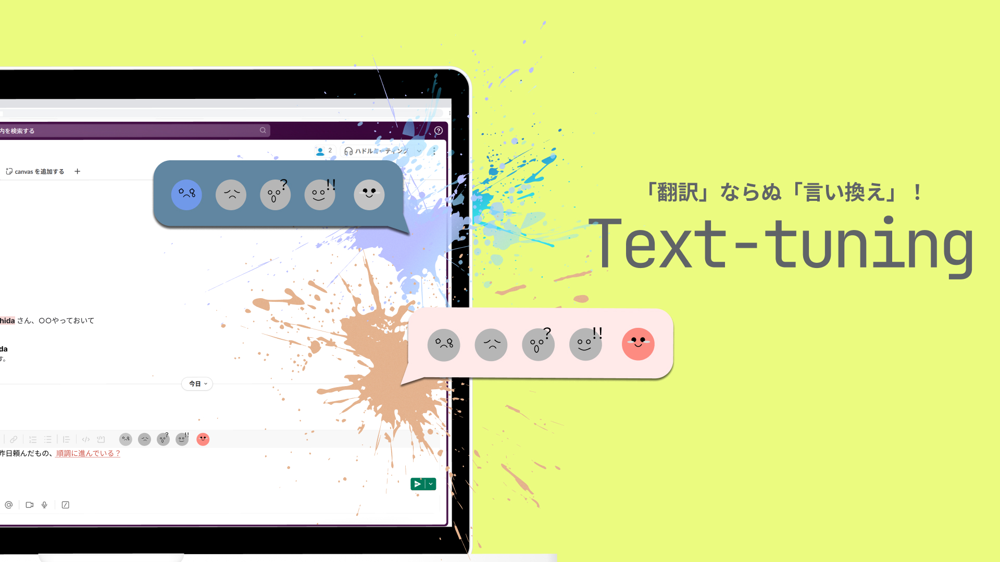

# サンプル（プロダクト名）

## 製品概要

「翻訳」ならぬ「言い換え」！

「スペルミス」だけでなく、「言い方ミス」まで指摘してくれるアプリ、「**Text Tuning**」！

### 背景 (製品開発のきっかけ、課題等）

#### きっかけ

- 我々は急遽当日に集められたグループであり、その場でプロダクト内容を考える必要があった。
- これを、柔軟に大会の趣旨に合わせることができると捉え、「**ブロックスポンサー賞**」を狙いに行こうと考えた
- 「**ブロックスポンサー賞**」には、「**Well-being**」や「**生成AI**」などがヒューチャーされていることがわかる
- そこで、「**Well-being**」を達成するために現存する課題を洗い出し、それを「**生成AI**」で解決しようと考えた。

#### 解決したい課題

- **メイン課題**
  - オンラインハラスメントをなくすこと
    - 対面でのハラスメントは検知しやすい一方、オンラインハラスメントは個人間でのやりとりであるため、**外部が察知しにくい**
    - 昨今はリモートワークが普及しており、社内でオンラインチャットツールを使う機会は増えている
    - そもそも、チャット上で**何がハラスメントなのかわからない**、という声もある
    - それを解決すべく、「ハラスメントに該当する」言葉に下線を引き、言い換え候補を表示する拡張機能を作ろうと考えた
- **サブ課題**
  - 勉強を楽しくすること
  - 誹謗中傷を減らすこと

### 製品説明（具体的な製品の説明）

英語翻訳ツール「grammaly」では、「英語のスペルミス」を検知して生成AIが「正しい単語を提案」してくれる

それと同じように、本ツールでは、「言い方のミス」を検知して生成AIが「優しい言い方を提案」してくれる

### 特長

#### 1. 特長1

- **受動的に**ハラスメント対策ができる
  - チャット送信者が意識することなく、**自動で**ハラスメントになりうる単語を検知して言い換えてくれるので、能動性を必要としない
  - そのため、**ハラスメント意識**が高くなくとも、**意識せざるを得ない**状況となる
  
#### 2. 特長2

- ハラスメントを**未然に**防ぐ
  - これまで様々なハラスメント対策がなされているが、これらはいずれも**事後対応**
  - 本ツールでは、送信前に自動で検知して言い換えを提案してくれるため、**ハラスメント被害が発生することなく**未然に防いでくれる
  - 日常的に使用できるため、**ハラスメント研修**などの事前対応よりも**効果が大きい**
  - ハラスメント行為者自身が**受動的に**何がハラスメントなのかを**学習できる**
    - ハラスメントの根本的原因が**行為者の意識**にあると考える

#### 3. 特長3

- ツール自体の**新規性**と**汎用性**
  - 本ツールは**スペルチェック**にとどまっていた機能を、**言い方のミス**にまで拡張したものであり、ツール自体が**新しい**
  - 現在はハラスメントに対するチェックであるが、生成AIに投げるプロンプトを変更するだけで、**古文単語**などを検知して**現代語**に変換する学習ツールに拡張したり、法律などの**固い日本語**を検知して**ギャル語**に変換することもできる
  - ハラスメントだけでなく、SNSに適用することで、**誹謗中傷**となる単語を改善することもできる

### 解決出来ること

- オンラインハラスメントを減少させる
  - ハラスメント行為者自身の**意識**を**日常的に改善**させる
    - **意識自体**が変わることで、オンラインチャット上だけでなく、日常生活における言い方も改善できる
  - **無意識に学習**できる
    - 能動性を必要としないため、ハラスメント意識の低い人でも優しい言い方を意識するようになる
  - これらにより、**働きやすく**なる
- 学習のハードルを下げる
  - 現在はハラスメントに対するチェックであるが、生成AIに投げるプロンプトを変更するだけで、**古文単語**などを検知して**現代語**に変換する学習ツールに拡張したり、法律などの**固い日本語**を検知して**ギャル語**に変換することもできる
  - 学習が**楽しく**なる
- 誹謗中傷をなくす
  - SNSに適用することで、**送信前**により良い言い方にした投稿をするようになる

### 今後の展望

### 注力したこと（こだわり等）

* 利用者が**受動的に**利用できるツールであること
* 見た目が**可愛い**こと
* 課題の**根本的解決**を目指すこと
  * ハラスメントをすることが原因なのではなく、ハラスメント行為者の**意識の低さ**が根本的原因
  * 意識を改善させるツール

## 開発技術

### 活用した技術

#### API・データ

* gemini API

#### フレームワーク・ライブラリ・モジュール

* Node.js
* Firebase
* css

### 独自技術

#### ハッカソンで開発した独自機能・技術

* 独自で開発したものの内容をこちらに記載してください
* 特に力を入れた部分をファイルリンク、またはcommit_idを記載してください。
